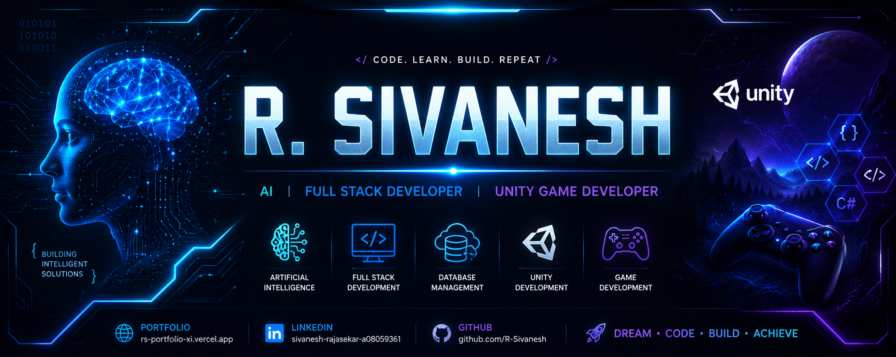

<div align="center">



<br><br>

[](https://rs-portfolio-xi.vercel.app/)
[](https://www.linkedin.com/in/sivanesh-rajasekar-a08059361)


</div>

---

# 👨‍💻 About Me

```yaml
Name        : R. Sivanesh
Education   : B.Tech Artificial Intelligence & Machine Learning

Passionate About:
  • Artificial Intelligence
  • Full Stack Development
  • Unity Game Development
  • UI / UX Design

Goal:
  Build innovative software that solves real-world problems.
```

---

# 💻 Programming Languages

<p align="center">


</p>

---

# 🛠 Tools & Technologies

<p align="center">


</p>

---

# 🚀 Featured Projects

### 🌱 AI Agriculture Advisor

AI-powered farming assistant for plant disease detection.

---

### 🌐 Portfolio Website

🔗 https://rs-portfolio-xi.vercel.app/

---

### 🎮 Unity Game Development

Developing games using Unity and C#.

---

### 🤖 AI Applications

Building intelligent applications using AI.

---

# 🎯 Goals 

- 🚀 Become an AI Engineer
- 💻 Master Full Stack Development
- 🎮 Publish Unity Games
- 🌍 Contribute to Open Source
- 📚 Learn Something New Every Day

---

<div align="center">

## 🌐 Connect With Me

<a href="https://rs-portfolio-xi.vercel.app/">

</a>

<a href="https://www.linkedin.com/in/sivanesh-rajasekar-a08059361">

</a>

<br><br>

### ⭐ Dream • Code • Build • Repeat

</div>
